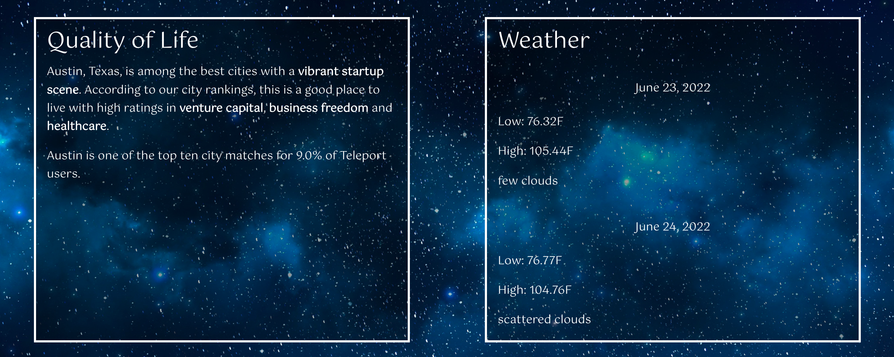
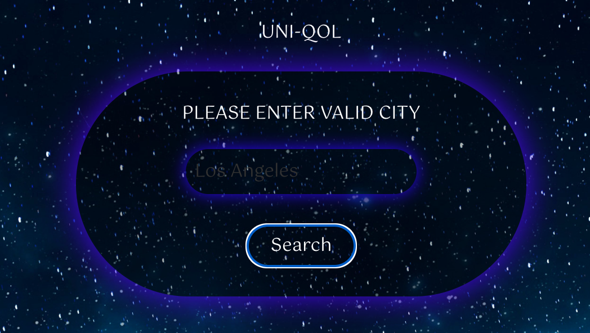
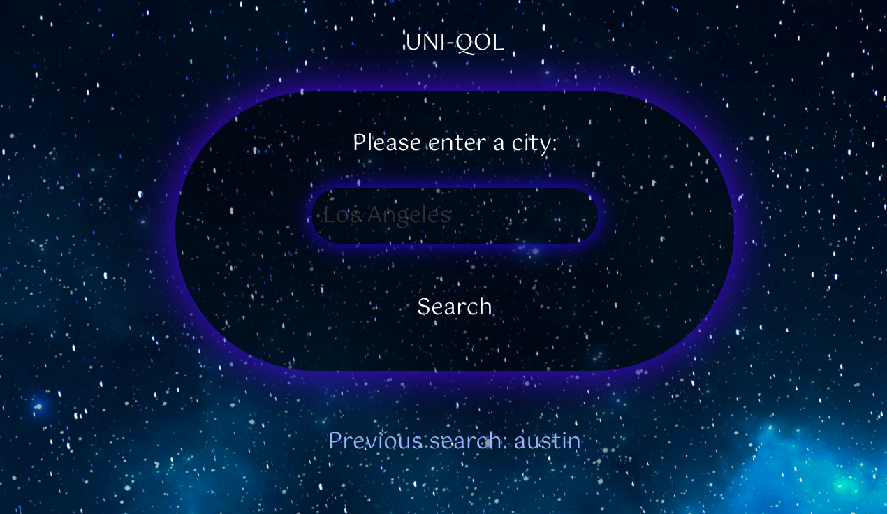

# Uni-QOL

https://caitlinparsons25.github.io/uni-qol/

## Technologies used:
* HTML
* CSS and Foundation framework
* JavaScript
    * jQuery
* APIs

## Aims of the project:
1. Create an app that allows users to input a city
2. When the user presses "Search" after entering a city, a quality of life summary and a weather forecast will appear
3. When a user inputs a city whose data is not available, an error message appears above the city input field
4. When the user refreshes the page, the city input and search page will reappear, with the most recently searched city listed

### 1. Create an app that allows users to input a city

Utilizing a form with an input field and a submit button, the app starts with the user typing in the name of the city they are interested in researching.

### 2. When the user presses "Search" after entering a city, a quality of life summary and a weather forecast will appear

After the user presses the "Search" button, two sets of data appear. The first is a summary of the quality of life for that city fetched from a quality of life API, and the second is a weather forecast fetched from a weather API.

### 3. When a user inputs a city whose data is not available, an error message appears above the city input field

If the user presses "Search" without entering a city or enters a city whose data is not available from the APIs being fetched, an error message will appear prompting the user to input a different (or valid) city.

### 4. When the user refreshes the page, the city input and search page will reappear, with the most recently searched city listed

Using local storage, when the user refreshes their browser, the start page is again presented to the user, and the most recent city the user has searched appears below the city search input form.

## Future features to implement:
* Specific quality of life data points
* Broader weather/climate information
* City comparisons

